# Setting up a Virtual Machine in VMWare

## Summary

This guide will go through how to set up a VMWare Virtual Machine, and install Arch Linux to it. I'll be making another guide for an OS such as Windows 10, which will be linked in this one after it's created.

### Prerequisites

* A computer running Windows 8 or newer, or a computer running Linux (ie. Ubuntu, Red Hat, CentOS, openSUSE, etc.)
	* Your computer must be 64-bit. Most Linux distros require this already, so if you're using any modern version of your distro, you're all set.
	* On Windows, you can check here: [Open About settings](https://sites.google.com/view/devinpoggers/winsettings-about) (This link will send you to a prompt to open in your Windows Settings! If you do not want this, you can go to Settings/System/About.
* At least 20GB more than the space you'll be giving your virtual machine. *This guide is not recommended for users on machines with less than 512GB storage on their drive, unless they have an external hard drive as well!*
* At least 2GB more ram than what you'll be alotting to your virtual machine.
	* I would personally recommend giving your virtual machine 2GB ram, that seems to be enough for me.
* An Arch Linux ISO file
	* Optional sub-prerequisite: A BitTorrent client. Torrenting Arch ISOs can make the download faster for yourself and others, if you leave your client open after download.
* An internet connection

## Part 1: Installing VMWare

1. Download [VMWare Workstation Player](https://www.vmware.com/products/workstation-player.html) from the VMWare website.
	i. On Windows, select the exe version. Linux users should select the bundle.
2. Run the executable.
3. Accept the EULA and click next.
4. Optionally check the Enhanced Keyboard Driver box.
	i. A reboot will be required if you choose to install it.
5. Click next twice.
	i. Optional: Uncheck the product updates and/or CEIP boxes before clicking next the second time.
6. Click next, then Install.
	i. If you had VMWare installed in the past, the installer will say Upgrade instead.
	ii.  If prompted for an Administrator password, enter it and click Yes.

## Part 2a: Downloading Arch Linux (BitTorrent, faster)

**Note:** This part will be split into two: One for downloading with a BitTorrent client and one for downloading in your browser.

1. Visit the Download page on the [Arch Linux website](https://archlinux.org/download/)

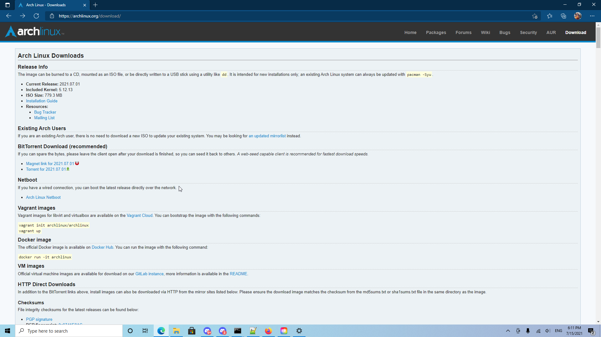

2. Use one of the following options to get your torrent ready.
	i. Click on the Magnet link. If you have a BitTorrent client installed, your browser will prompt you to allow the Arch Linux website to open it.
	
	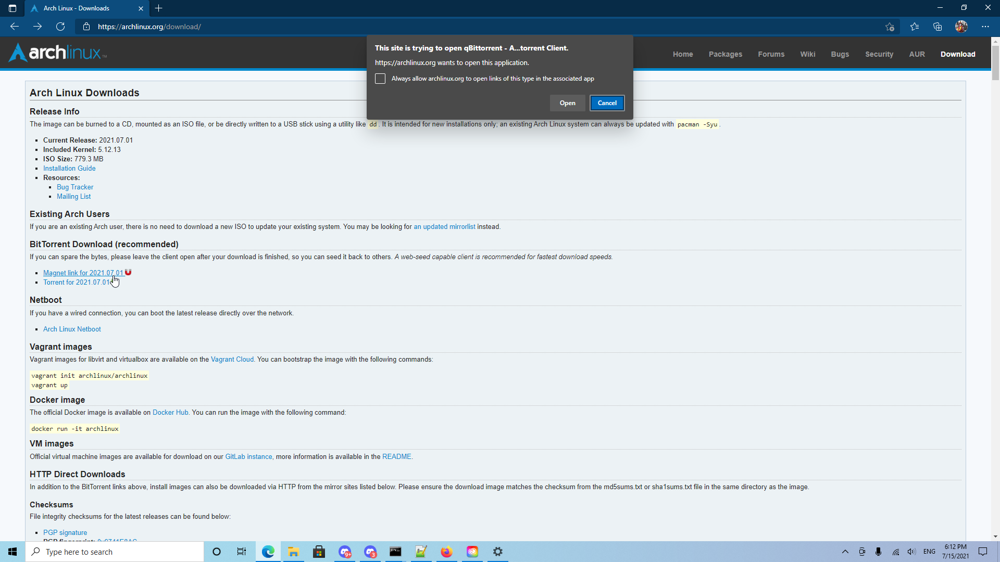
	
	ii. Click on the Torrent link. This will download a file, which you will have to open manually.

3. Confirm the torrent download location and settings.

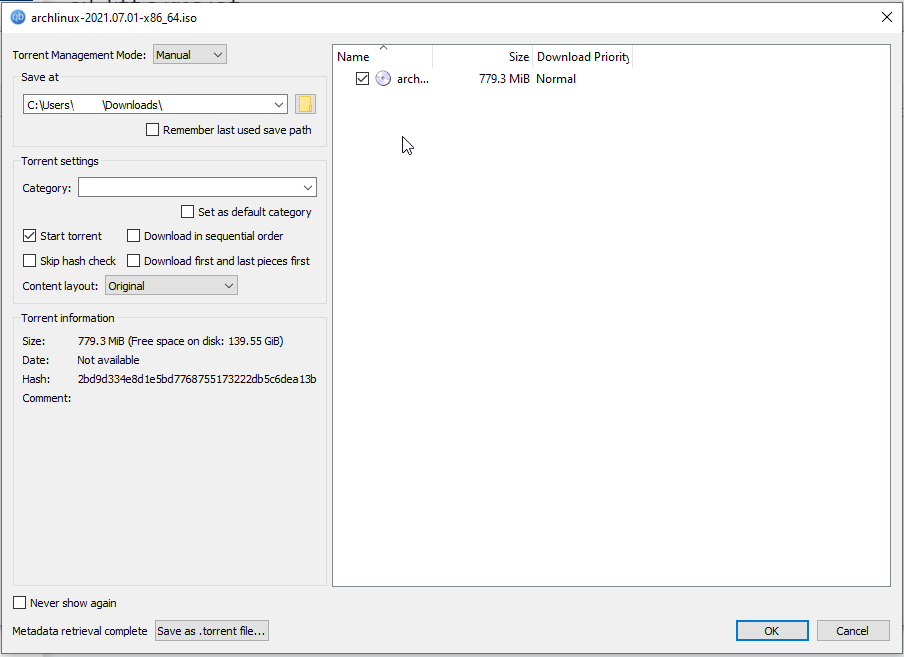

4. Your BitTorrent client will proceed to download the latest Arch Linux ISO file. This may take between 5-30 minutes or more, depending on your internet connection and how many peers are currently seeding the file.
	i. For me, this process took around 3 minutes.

## Part 2b: Downloading Arch Linux (in browser, slower)

**Note:** This section goes over downloading the Arch Linux ISO in your browser.

1. Visit the Download page on the [Arch Linux website](https://archlinux.org/download/)


2. Scroll down to the HTTP Direct Downloads section.

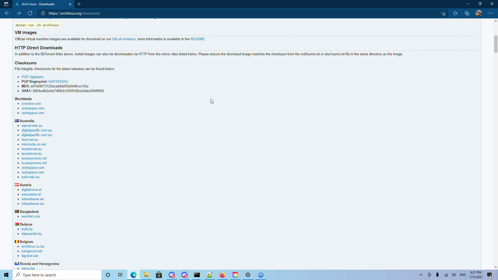

3. Scroll until you find your region in the list.

4. Select a mirror for your region.
	i. It's recommended to use a server closer to your location. I went for the arizona.edu mirror.2

5. Click on the archlinux-date-x86_64.iso link.
	i. Your browser will start downloading the ISO file. This may take between 15-60 minutes or more, depending on your internet connection, which mirror you chose, and your proximity to the mirror.
		a. For me, this took around 17 minutes with an average of around 600-1000KB/s.

## Part 3: Setting up your virtual machine

1. Start VMWare from your Start menu.

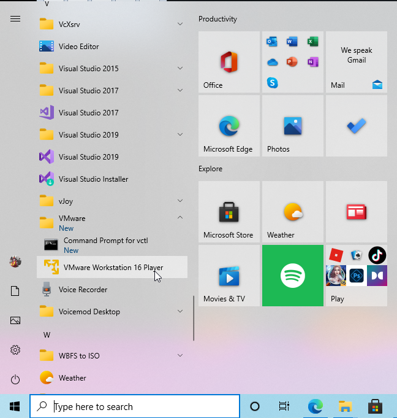

2. Click Continue to use VMWare without a license, then Finish.

3. Click "Create a New Virtual Machine".

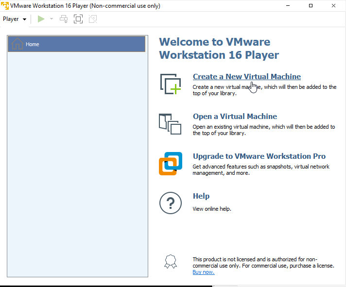

4. Select the "Installer disc image file (iso)" radio button, then click Browse and navigate to your Arch ISO. If you didn't change the location, just click Downloads on the left.
	i. VMWare will warn you that it cannot find an operating system in the image. This is normal for Arch. Just click next.
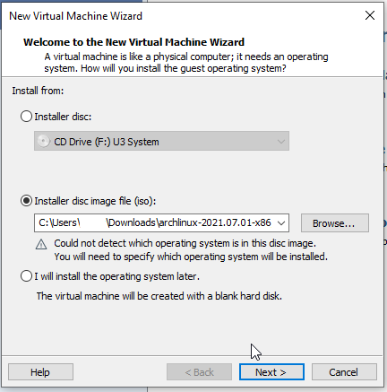
5. Select the Linux radio button, then change the Version to "Other Linux 5.x and later kernel 64-bit".
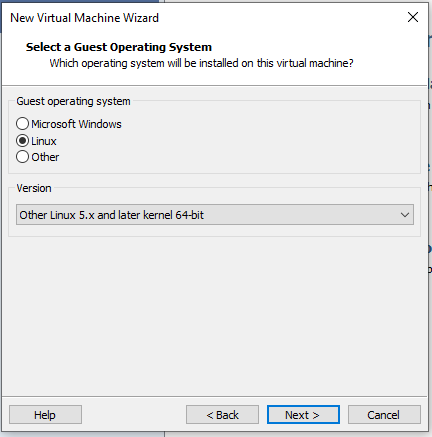
6. Click next, then optionally type another name for your virtual machine before clicking next.

	i. By default, VMWare uses the version name of the Guest OS.
	
	ii. You can also change the location from the default of "C:\Users\User\Documents\Virtual Machines" if you want.
	
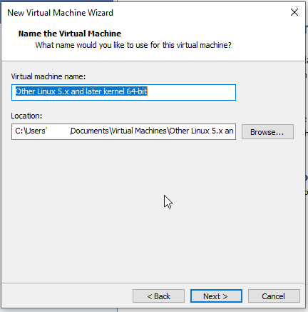
7. Select the maximum disk size you want for your virtual machine, then click next.

	i. By default with Linux 5.x or newer kernel VMs, VMWare will suggest a maximum size of 8GB. I suggest going for 64GB or larger.
	
	ii. If you do not have very much space on your disk, go back to step 6 and change the location of your virtual machine to another medium such as an external hard drive.
	
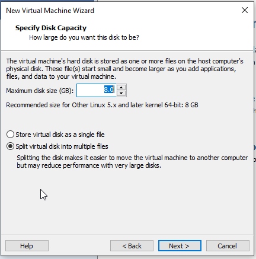

8. Confirm the settings of your virtual machine, then click Finish.
	
	i. VMWare will assign 768MB of RAM to your Virtual Machine by default. For Arch, I recommend bumping this up to 2048MB (2GB).
	
	ii. Here are the settings for my example VM:
	
		a. Name: Arch Beanux
		
		b. Location: C:\Users\<My Account>\Documents\Virtual Machines\Arch Beanux
		
		c. Version: Workstation 16.x
		
		d. Operating System: Other Linux 5.x and later kernel 64-bit
		
		e. Hard Disk: 64 GB, Split
		
		f. Memory: 2048 MB
		
		g. Network Adapter: Bridged
		
		h. Other devices:
		
			1. 2 CPU cores
			
			2. CD/DVD
			
			3. USB Controller
			
			4. Printer
			
			5. Sound Card
			
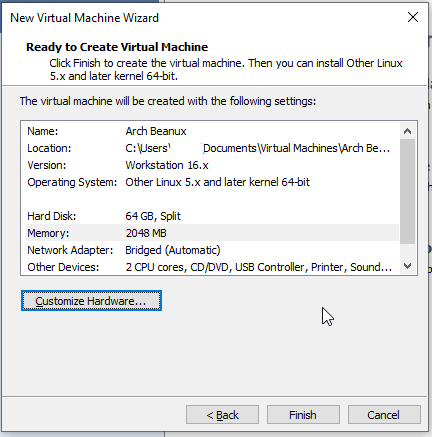

9. Click on "Edit virtual machine settings", as we're not quite done yet.
10. Click on "Options", then click in the Working directory field and press CTRL+A/CTRL+C to copy your virtual machine directory.
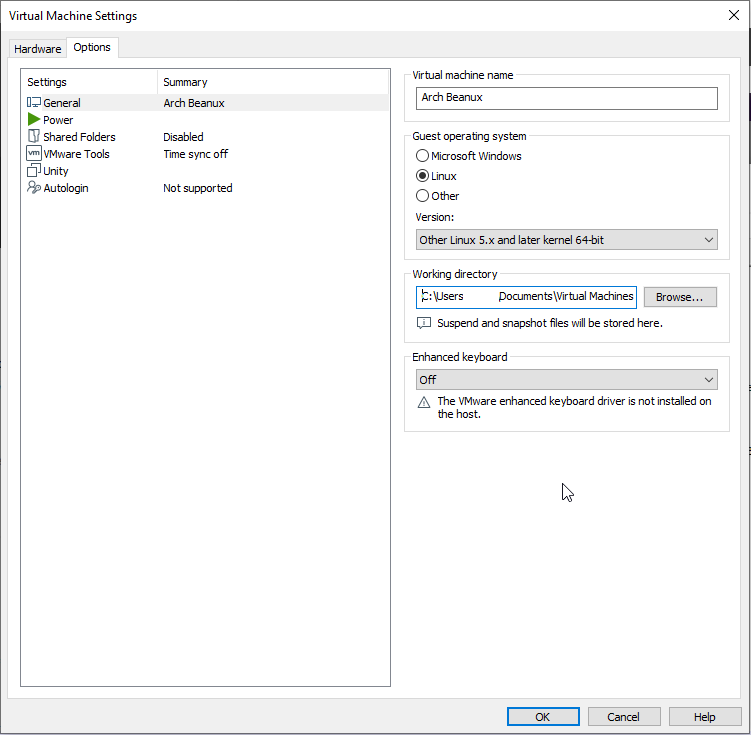
11. Press WINKEY+R to open the Run dialog, then paste your virtual machine directory.
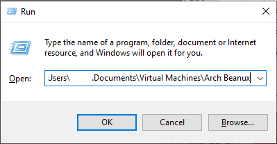
12. Right click on the vmx file and select "Open with...", then click on Show more applications and select Notepad.
13. Below the first line, add the following: `firmware="efi"`
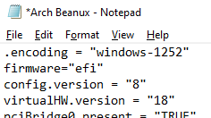
14. Save the file and restart VMWare.

## Part 4: Installing Arch Linux in your new Virtual Machine

1. Click "Play virtual machine" to start your virtual machine.
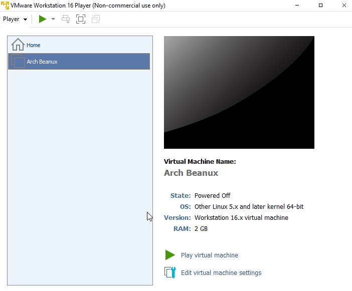

2. Press Enter to boot into the Arch install environment.
	i. You may be prompted to download and install an update to VMWare Tools. Click "Remind me later". Arch doesn't use the normal VMWare tools regardless, I believe.
	ii. If you need assistive screen reader, press the DOWN arrow key once and hit enter.

3. Arch Linux will boot. Wait for the screen to show something similar to the prompt below.
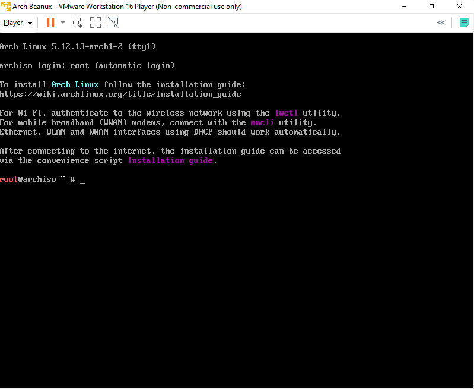

4. If necessary, change your keyboard layout. The default is US, which should work for the most part.
	1. Type "ls /usr/share/kbd/keymaps/\*\*/\*.map.gz" and press enter.
		i. Your layout may not show, as the screen is small. I recommend doing this instead: Type "localectl list-keymaps | grep -i *your_country*" (example for Brazil: `localectl list-keymaps | grep -i br`) and press enter.
	2. Type "loadkeys *your_keymap*" (example: `loadkeys us`)
	
5. Check your network connection by typing "ping archlinux.org -c 3" and pressing enter.
	i. This should work automatically. If it doesn't, check the [Arch Wiki](https://wiki.archlinux.org) for information on how to set up networking.

6. Update the system clock by typing "timedatectl set-ntp true" and pressing enter. You can check the status of the service by running "timedatectl status".

7. Partition the virtual machine's disks.

	i. I recommend using cfdisk, as that's what I'll be using in this guide. Just type "cfdisk" and press enter.
	
	ii. Steps for cfdisk:
	
		1. Press enter to use the GPT label type.
		
		2. Press enter to create a new partition, then press backspace and type "260M". Press enter.
		
		3. Press the RIGHT arrow key to highlight Type, then press enter. Press the UP arrow key until "EFI System" is highlighted and press enter. (Optional, skip to step 7 if you want to skip a swap partition.)
		
		4. Press the DOWN arrow key, then press enter.
		
		5. Press backspace, then type "768M" and press enter.
		
		6. Press the RIGHT arrow key to highlight Type, then press enter. Press the UP arrow key once and press enter to set the partition type to Linux swap.
		
		7. Press the DOWN arrow key and press enter twice.
		
		8. Press the RIGHT arrow key three times to highlight Write. Press enter and type "yes", then press enter again.
		
		9. Press the LEFT arrow key three times to highlight Quit, then press enter to exit cfdisk. Make note of your partitions. The screen should be similar to this.
		
		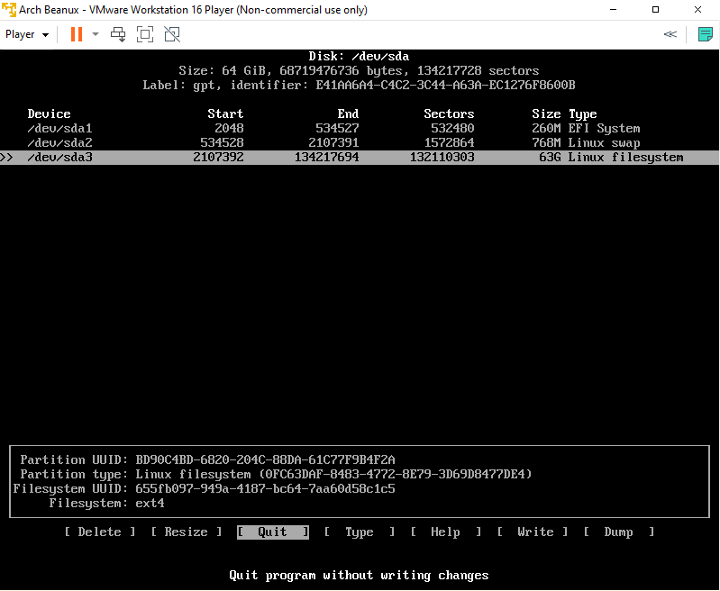

8. Create the filesystem(s) for Arch and, if you added one, your swap partition.

	i. To create your Arch filesystem, type "mkfs.ext4 /dev/sdaX" (with X being the partition number of your Arch partition. This was your Linux filesystem in cfdisk.) and press enter.
	
		1. In my example, this was sda3.
		
	ii. (Optional, skip if you didn't create a swap partition) Type "mkswap /dev/sdaY" (with Y being the partition number of your swap partition. This was your Linux swap in cfdisk.) and press enter. 
	
	**Note:** I had already done this before remembering to take screenshots of cfdisk and the commands, so your output will be different from mine.
	
	iii. I suggest also formatting your EFI partition as vfat by running "mkfs.vfat -F32 /dev/sdaW" (with W representing your EFI partition, usually sda1), just in case.
	
	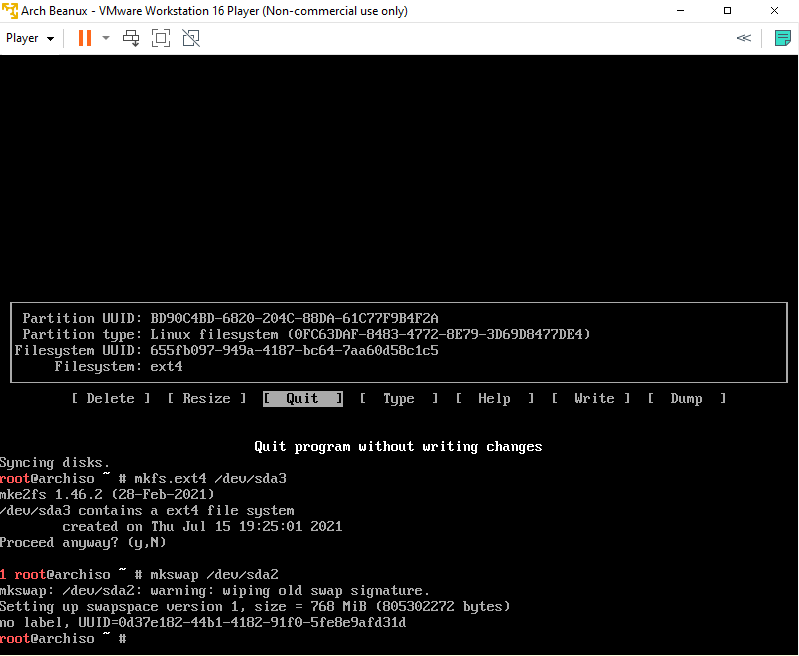
	
9. Mount your Arch partition to the /mnt directory by running "mount /dev/sdaX /mnt".

10. (Optional, skip if you didn't create a swap partition) Enable your swap partition with the following command: "swapon /dev/sdaY"

11. Create a mount point for your EFI directory by running "mkdir /mnt/efi ; mount /dev/sdaW /mnt/efi" (with W representing your EFI partition, usually sda1).

12. Install the base package, Linux kernel, and firmware for common hardware by running "pacstrap /mnt base linux linux-firmware".
	
	i. (Recommended) Install additional packages with the same pacstrap command by adding them after linux-firmware. I recommend dhcpcd, nano, man-db, man-pages, texinfo, and xorg. If you use these recommendations, your pacstrap command should look like **this** instead: "pacstrap /mnt base linux linux-firmware dhcpcd nano man-db man-pages texinfo xorg"
	
	ii. (Optional) If you want to have a desktop environment upon reboot, add a [Desktop Environment](https://wiki.archlinux.org/title/Desktop_environment#List_of_desktop_environments) package to the end of your pacstrap, as well as a Display Manager such as lightdm (recommended for Cinnamon/XFCE), gdm (recommended for GNOME/gdm), or sddm (recommended for KDE Plasma). You can find a list of graphical Display Managers [here](https://wiki.archlinux.org/title/Display_manager#Graphical). If you do this, your pacstrap should look like **this**, following the recommendation above as well and using GNOME/gdm as an example: "pacstrap /mnt base linux linux-firmware dhcpcd nano man-db man-pages texinfo xorg gnome gdm"
	
	iii. (Recommended if installing a Desktop Environment at the start) Add a terminal emulator, such as konsole or mate-terminal to the end of your pacstrap command.
	
	iv. This may take around 15 minutes or more, depending on how many packages you install, your internet connection, and your computer's memory. pacstrap will display how long the command took at the end. Additionally, the Total line at the bottom includes a timer which updates as packages download.
	
		a. For me, this process took around 12 minutes total.

13. Generate an fstab file for your Arch installation by running "genfstab -U /mnt >> /mnt/etc/fstab".

14. Change root (chroot) into your installation. Type "arch-chroot /mnt" and press enter.

	i. (Optional) You can clear the screen here if you'd like, just type "clear" and press enter.
	
15. Set the time zone by running "ln -sf /usr/share/zoneinfo/Region/City /etc/localtime" (ex: "ln -sf /usr/share/zoneinfo/America/New_York /etc/localtime")

	i. You can see a list of time zones by running "ls -R /usr/share/zoneinfo".
	
16. Run "hwclock" to generate the /etc/adjtime file: `hwclock --systohc`

17. Edit /etc/locale.gen and uncomment the locales needed for your computer, then run locale-gen to generate locales.

	i. It may be helpful to press CTRL+W and type your locale. For English (US), type "en_us.UTF-8" and press enter to jump to that line.
	
	ii. Uncommenting in the locale.gen file means **deleting the hashtag at the start of a line**, which also applies to various programming languages.
	
18. Create the locale.conf file, and set the LANG variable to your language. This is the locale you uncommented in the previous step.

	i. To create this file, run one of the following commands:
	
		a. `touch /etc/locale.conf`
		
		b. `echo LANG=yourlocale > /etc/locale.conf`
		
	ii. If you use the touch command, edit the locale.conf and type "LANG=*yourlocale*", then save and exit.
	
19. If you set the keyboard locale to a non-default one, make the changes persistent in vconsole.conf: Run "echo KEYMAP=*your_keymap* > /etc/vconsole.conf"

20. Create a hostname file.
	
	i. Run the following command: `echo HOSTNAME > /etc/hostname`, replacing "HOSTNAME" with a name of your choosing. Valid characters are A-Z, 1-9, and hyphen (-). Try to keep it to 15 characters or less.
	
21. Add entries to /etc/hosts to match your hostname.
	
	i. Like this: ```
	cat << EOF >> /etc/hosts
	127.0.0.1 localhost
	::1 localhost
	127.0.1.1 HOSTNAME.localdomain HOSTNAME
	EOF```
	
22. Set the root password by running passwd.

	i. Type a password you'll remember, regardless of whether you plan to add a new user before rebooting or not.
	
23. Choose and install a Linux-capable boot loader, such as GRUB.
	i. To install the grub package, type "pacman -S grub efibootmgr --noconfirm".
	
	ii. To install GRUB to your virtual machine's bootloader, run the following command: `grub-install --target=x86_64-efi --efi-directory=/boot/efi --bootloader-id=Arch` (You can replace the bootloader ID with any name. To have a spaced name, use quotes around the bootloader ID argument, such as `--bootloader-id="Bean Machine"`)
	
	ii. Generate a grub config file by running `grub-mkconfig -o /boot/grub/grub.cfg`
	
24. (Optional, but recommended if you installed a Desktop Environment) Create a regular user account.

	i. Run the following command: `useradd -m -G wheel,power,lp,audio,sys yourname`
	
		a. The only limitation on your username is that you **cannot** have capital letters.
		
		b. By adding your account to the `wheel` group, you ensure that you can run sudo commands. (You may have to install sudo. Run `pacman -S sudo --noconfirm` if it isn't installed automatically)
			i. You may have to edit the sudo.conf file by running visudo (add "EDITOR=nano" in front if vim isn't installed) and uncomment the following line: `# %wheel ALL=(ALL) ALL`
			
		c. Run `passwd yourname` and enter a password for your account. **It's recommended to not have the same password as root,** although in a virtual machine it should be fine.
		
25. (Recommended if you installed a Desktop Environment) Type `systemctl enable <sddm/gdm/lightdm>`, depending on which Display Manager you installed.

26. (Recommended) Type `systemctl enable dhcpcd` and press enter.

26. Press CTRL+D to exit the chroot environment, then type `reboot` and press enter to reboot into your new Arch install. Enjoy!

## Part 5: Installing VMWare tools

**Note:** These instructions are taken from the official Arch Linux wiki. For questions, please use Google or ask on the Arch forums.

1. Sign into either the root account or your user account, depending on whether you added a new user during installation or not.
2. Press CTRL+ALT to return control to your host. Then, click Player > Manage > Install VMWare Tools
	i.  If you are prompted for an Administrator password by Windows, enter your password and click Yes.
3. If you didn't install a desktop environment, skip this step. Otherwise, open a terminal. You can usually hit the WINKEY and type "Terminal" to find it.
	i. Didn't install a terminal? Press CTRL+ALT+F3 to access the tty. (I have a terminal, so my follow as I write strategy will be in a graphical environment as opposed to TTY)
4. Run the following commands, omitting sudo and "/Desktop/" if you are root.
	1. `sudo pacman -S base-devel net-tools linux-headers asp` (Press ENTER to use defaults.)
	2. `for x in {0..6} ; do sudo mkdir -pv /etc/init.d/rc${x}.d ; done
	3. `sudo mount -v /dev/cdrom /mnt`
	4. `mkdir ~/Desktop/VMWTools`
	5. `tar -xf /mnt/VMwareTools*.tar.gz -C ~/Desktop/VMWTools`
	6. `sudo perl ~/Desktop/VMWTools/vmware-tools-distrib/vmware-install.pl` (Press enter to keep defaults, change only if you want to)
	7. `asp checkout open-vm-tools`
	8. `cd open-vm-tools/repos/community-x86_64/`
	9. `makepkg -s --asdeps`
	10. `sudo cp vm* /usr/lib/systemd/system`
	11. `systemctl enable vmware-vmblock-fuse`
	12. `systemctl enable vmtoolsd`
	13. `systemctl reboot`
	14. `/etc/init.d/rc6.d/K99vmware-tools start`
5. To auto-start VMWare Tools on boot, create a file named `vmwaretools.service` in /etc/systemd/system, and enter the following:
```
[Unit]
Description=VMWare Tools daemon

[Service]
ExecStart=/etc/init.d/vmware-tools start
ExecStop=/etc/init.d/vmware-tools stop
PIDFile=/var/lock/subsys/vmware
TimeoutSec=0
RemainAfterExit=yes

[Install]
WantedBy=multi-user.target```
6. Enable the new systemd service: `systemctl enable vmwaretools.service`

## Part 6: Installing a Desktop Environment (Optional)

**Note:** This section goes over installation of multiple Desktop Environments.

### GNOME

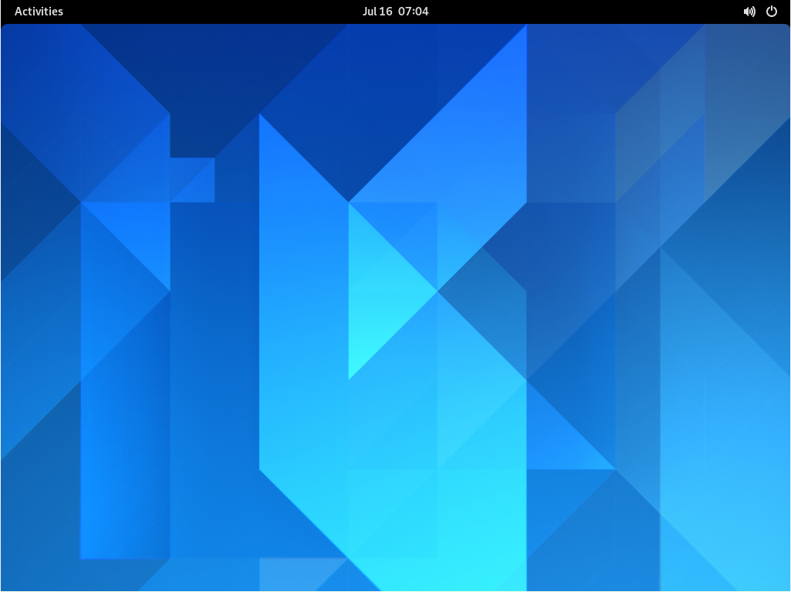

To install the GNOME Desktop Environment after rebooting your Arch virtual machine, follow these steps. You can also do this if you already installed another environment during initial installation with pacstrap.

1. Sign into either root or your user account.
2. Run these commands, omitting sudo if you're signing in as root.
	1. `sudo pacman -S gnome gdm xorg --noconfirm`
	2. `systemctl enable gdm`
	3. `reboot`
3. Enjoy the GNOME environment.

### KDE Plasma

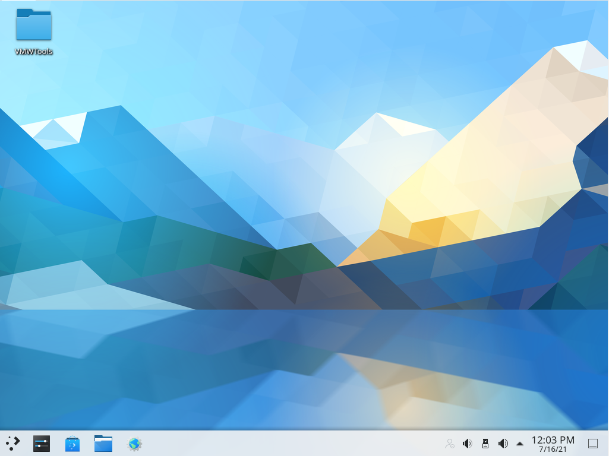

To install the KDE Desktop Environment after rebooting your Arch virtual machine, follow these steps. You can also do this if you already installed another environment during initial installation with pacstrap.

1. Sign into either root or your user account.
2. Run these commands, omitting sudo if you're signing in as root. (Omit sddm if you have a Display Manager already)
	1. `sudo pacman -S plasma sddm kde-applications xorg --noconfirm`
	2. `systemctl enable sddm`
	3. `reboot`
3. Enjoy the KDE Plasma environment.