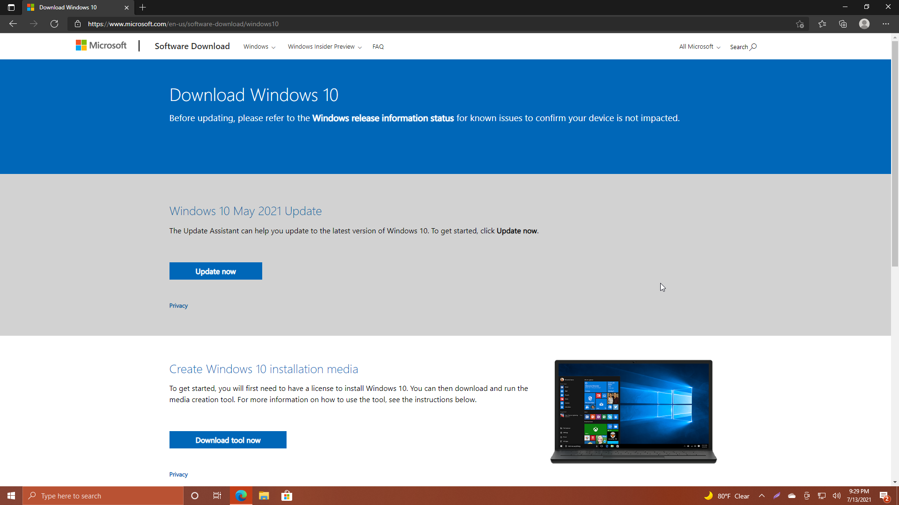

# Setting up the sethc/cmd trick

This tutorial goes over how to perform the sethc/cmd trick.

## Summary

The sethc/cmd trick allows users to access a command prompt on the login screen, by pressing the Shift key 5 times. **This trick is dangerous, so make sure you revert the changes afterward. If you forget, a Windows Update will revert it for you, but you're leaving your computer open to anyone who has access.**

### Prerequisites

* An internet connection
* At least 6GB space free on your USB drive and/or computer
* A USB flash drive of 8GB or larger in size
	* You can find 8GB drives on Amazon for $10. They're also sold at many stores that specialize in office supplies or electronics, such as Office Depot, Best Buy, and Micro Center in the US.
* A computer with Windows 7 or newer.
	* Architecture (meaning 32-bit/64-bit) doesn't matter, as you can write to your USB drive for the architecture on the computer you need to perform this trick on, regardless of the architecture on what you're writing from.

### Part 1: Preparing the Windows USB drive

1. Insert a USB flash drive of 8GB or larger in size into a computer you can sign into.

2. Go to the [Download Windows 10](https://www.microsoft.com/en-us/software-download/windows10ISO) page on Microsoft's website.

3. Download the ISO if prompted (see image below), or the Media Creation Tool.

4. If you downloaded the ISO, skip to step 6. This step lists the steps for the Media Creation Tool.

	i. Run the Media Creation Tool. If a UAC prompt appears, enter your password (if prompted) and click Yes to continue.
	
	ii. Accept the EULA. You can't continue without doing so, no matter how much you hate Windows.
	
	
	
	iii. On the "What do you want to do?" page, select "Create installation media for another PC".
	
	
	iv. If the computer you need to perform the trick on has a different language and/or architecture (32/64bit) from the PC you're creating the installation media on, uncheck the "Use the recommended options for this PC" box and select your language and architecture.
	
	
		i. If Windows mentions your disk not having enough space on your system drive, try deleting some files you don't need and won't miss.
		
		ii. If you have files on your drive you want to keep, back them up to another location such as a folder on your Desktop or a cloud service such as OneDrive or Google Drive.
		
	v. Wait for Windows setup to finish setting up your drive.
	
5. To write the ISO to your drive, use the following steps.

	i. Download [Rufus](http://rufus.ie/en_US/) and run the executable.
	
	
	
	ii. Select the drive corresponding to your USB drive. It may be shown as "NO LABEL" if you haven't labelled your drive.
	
	
	
	iii. Click the **Select** button, then navigate to and double click your Windows ISO file.
	
	iv. Once your Windows ISO file has been selected, the app UI will update. Click Start. i. You will be asked one last time if you want to continue, as all data will be deleted on your drive. I recommend backing up your files if you want to avoid losing your them.
		
	
		
	v. Wait for Rufus to finish.

### Part 2: Setting up the trick

1. Reboot your system.

	i. I suggest holding Shift down while doing this, as it's one of the faster ways to boot to the USB drive.
	
2. Boot into your USB drive.

	i. If you held Shift while rebooting, follow the steps below. Otherwise, follow the next set.
	
	i. On the "Choose an Option" screen, select either "Use a device" or "Troubleshoot". For this guide, I'll use the Troubleshoot options.
		
	i. To boot your USB drive via the Use a device menu, select "UEFI:Removable Device" or a similar option.
			
	
		
	ii. Select Advanced options.
		
	
		
	iii. Choose "UEFI Firmware Settings", then click Restart.
		
	
		
	iv. If given a menu like the one below, select the USB drive (or CD-ROM in a Virtual Machine).
	
	
		
	v. If given a menu with options such as F1 for System information, F2 for diagnostics, etc., press the F# key next to "Boot Device Options", then select your USB drive.
		
3. Once on the setup screen, confirm your language settings and click Next.

4. Click "Repair your computer". **Do not click Install now.**

5. Click Troubleshoot.

6. Click Command Prompt.

7. Type "cd /d C:\Windows\System32" and press enter.

	i. If you get an error about a nonexistent path, try changing the letter from C until you are in your System32 directory.
	
8. Type "copy sethc.exe sethc.bak" and press enter.

9. Type "copy cmd.exe sethc.exe" and press enter, then type Y and press enter again.

10. Exit the command prompt.

### Using the trick to add a new user

1. Click the "Continue" option in the menu.
2. Once Windows loads, press the Shift key 5 times in a row. If it worked properly, a command prompt window should now be on screen.

3. Type "net user add AnyNameHere /add" and press enter.
4. Type "net user AnyNameHere *" and press enter.
	i. Enter a password. It will not be displayed back to you.
5. Type "net user localgroup Administrators AnyNameHere /add" and press enter.
6. Type "exit" and press enter.
7. Wait for the signin screen to return to the lock screen, then click again and your account should appear on screen!
